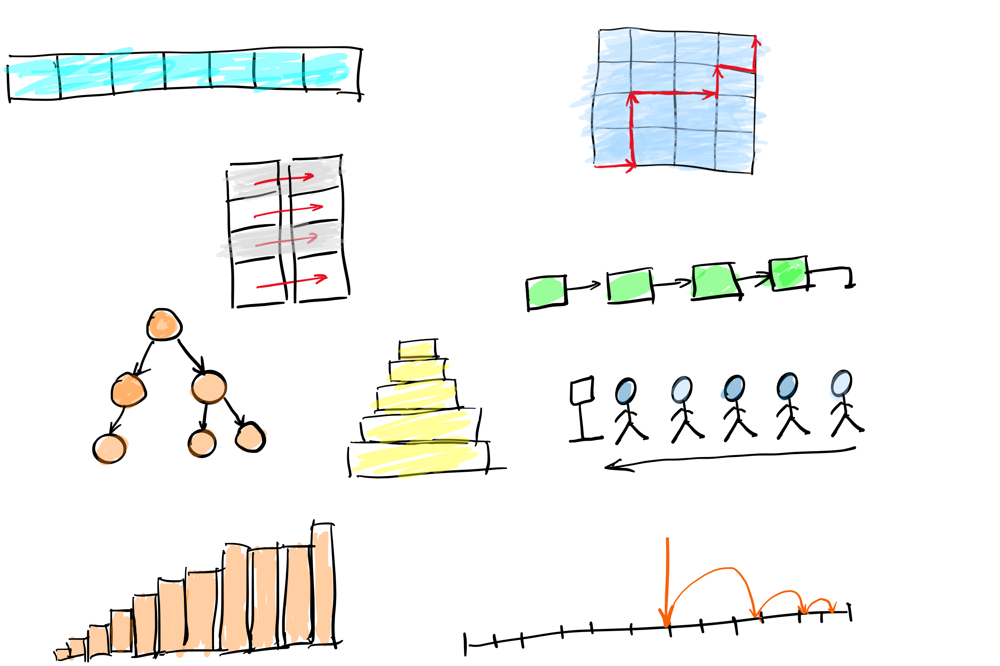

# CSS 143 Computer Programming II

## Prerequisites

Minimum grade of 2.7 in CSS 161, CSS 142, or CSE 142. Co-requisite: CSSSKL 143. 

## Course Info

| Key Info             |                                                              |
| -------------------- | ------------------------------------------------------------ |
| Date & Time          | MW 5:45pm - 7:45pm                                           |
| Lecture Location     | [Zoom meeting url](https://washington.zoom.us/j/96245343380). Full invite [here](zoom.md)                                                         |
| Lecturer             | [Peng Du](https://www.linkedin.com/in/peng-du-ph-d-14b0a11b) (Discord: @fatgoooose) |
| Grader               | Jackie Kelly (Discord: @jackiek06)                           |
| Volunteer Assistance | Kevin Blair (Discord: @MadArkadian)                          |
| Email                | pengdu@uw.edu ([CSS143] MUST show on subject)                |
| Office Hours         | Discord ([use this invite to join](https://discord.gg/tQy6tZg)) |

## Course Objectives

The objectives of this course are for students to: 

- Transition from basic programming skills to a rigorous software development. This includes:
  - Problem solving with data structures and algoriothms
  - Clean code
  - Modern development tools and idealogies (Intellij, Git, Github, JUnit, Maven, Test Driven Development)
- Becoming familiar with higher-level programming techniques (object‐orientation, recursion, inheritance, generic programming), constructs (lists, stacks, queues, trees) and algorithms (searching, sorting).

## Course Learning Outcomes
Upon successful completion of the course, students shall be able to:
- **Programming**: Fluent with object-oriented programming using JAVA
- **Data structure**: Understand the concepts and implementation of various basic data structures such as array, list, tree
- **Algorithm**: Understand basic algorithms such as searching, sorting, recursion
- **Problem solving**: Make trade-offs between solutions based on performance analysis in terms of time and space complexity.
- **Coding practice**: Write well-structured an well-tested codes  

## Class Communication
- **Canvas** mainly for assigning tasks (homework, quizzes, and exams) and scores
- **Discord** for announcements, discussion forums, assignment posting, and individual grades.
- For any direct/individual communication with instructor please prioritieze in the order of ***Discord/Canvas/Email***

### Coursework Distribution
| Course Work | Grading % |
|-------------|-----------|
| Homeworks | 30        |
| Quiz & In-class exercises      | 5        |
| Midterm exam       | 40        |
| Final exam      | 25        |
| Total | 100 |

### Grading Rubric
All grades will be listed as percentages in the Canvas LMS. The conversion table below will help you determine your final grade. For example, if you earn 950 points (or 95%) you will get a 4.0. If you earn 750 points (or 75%) you will earn a 2.0.

## Textbooks
### Required
- Savitch, Walter, Absolute Java, 6th Edition, Pearson, 2016, ISBN 0134041674.

## Lecture
- Read the relevant textbook chapters before each class.
- Lecture video and slides will be made available after each class.
- Slides are for reference only and tentative to change even after lecture.
- Take notes. Write down your questions in class and follow up later.
- There will be live coding and debugging by both the lecture and students.

## Tentative Schedule

- The following table provides an approximate, high-level ordering of topics, not all sections in the book are covered. 
- Schedule is tentative and subject to change. Changes will be announced in class and/or Discrod channels.

|  Date | Week | Topics | Chapters | Homework |
| --- | --- | --- | :--- | --- |
|  9/30 | 1 | Course intro Java basics Maven, Git and grading system | 1.2 3.1-3.3 | [homework 1](https://github.com/pdgetrf/CSS143B-2020Fall/tree/master/homework/homework_1) |
|  10/05, 10/07 | 2 | Java programming basics OOP concepts | 4 5.2, 5.3 7, 8.1, 8.2 13.1 | [homework 2](https://github.com/pdgetrf/CSS143B-2020Fall/tree/master/homework/homework_2)  |
|  10/12, 10/14 | 3 | Abstract data types: array, list | 6.1-6.3 15.1 | [homework 3](https://github.com/pdgetrf/CSS143B-2020Fall/tree/master/homework/homework_3)  |
|  10/19, 10/21 | 4 | 10/19 Midterm 1 ADTs: stack, queue | 15.4 |  |
|  10/26, 10/28 | 5 | Recursion (and backtracking) | 11 | [homework 4](https://github.com/pdgetrf/CSS143B-2020Fall/tree/master/homework/homework_4)  |
|  11/02, 11/04 | 6 | Special topic: A tale of two linkedlist reversals  ADT: Binary Tree | 15.7 |  |
|  11/09, 11/11 | 7 | More on Binary Trees, Searching (BFS and DFS) 11/11 No class (Veterans Day) |  | [homework 5](https://github.com/pdgetrf/CSS143B-2020Fall/tree/master/homework/homework_5) |
|  11/16, 11/18 | 8 | Dictionary 11/18 Midterm 2 | 15.5 |  |
|  11/23, 11/25 | 9 | Guest lecture (Marvin: FPV drone programming)   Final project review |  | final project |
|  11/30, 12/02 | 10 | Sorting & complexity analysis   Final project review |  | homework 6   |
|  12/07 - 12/09 | 11 | Special topic: Binary Tree in Database   homework review |  |  |
|  12/14 - 12/16 | 12 | 12/14 Final exam review   12/16 Final exam |  |  |

## Computer
All students are expected to have unfettered access to a personal computer (Windows, Mac, Linux, etc.) or netbook with broadband-speed Internet access. Student access to University computing resources fulfills this requirement. All students are assumed to be proficient with an office productivity suite and email. All students must enable their Canvas Notifications for this course (Links to an external site.) to be at least as frequent as the defaults; if I post announcements, etc. via Canvas, you need to be able to receive them. All students must have a valid email account that they check on a daily basis.

## Operating System
Since JAVA will be used for programming and it is cross-platform ("write once, run anywhere"), there's no specific requirement for what operating system you can use for coding. The instructor will be using MacOS and Linux.

## Dev Tools
Recommended: [Intellij Idea](https://www.jetbrains.com/idea/). This has a free community version and also [free for students](https://www.jetbrains.com/student/). Feel free to use any other development environments too, it being Eclipse or even VIM. For homeworks only the source codes are of interests for grading.

## What to bring to lecture
- A laptop or tablet: We'll do live coding occasionally during the lecture. 
- A writing tool and paper: Most of the practice in class will be done by hand.
- The textbook: We'll be talking through examples, etc.

## Class Attendance
- Class attendance is not mandatory. However, I strongly encourage you to come online to class as there is generally a direct correlation between attendance and performance (aka, grade).
- Quizzes and exams will be given during class.
- You will be held responsible for learning all material covered in class, regardless of its presence (or lack thereof) in the textbook or internet.

## Programming Assignments
- All programming assignments will be given using Git repositories. This will be introduced in the first few lectures so we get all comfortable with it even witout any previous experience.
- Submission will be using GitHub and/or Canvas depending on the types of homework. 
- Late assignments will **NOT** be accepted unless there has been a previous agreement due to exceptional circumstances. 

The homework code is graded upon the following aspects: 

- Style / Syntax: i.e. following Coding Guidelines; Clarity 
- Factoring / Design: i.e. modularity; Interface Design 
- Correctness – determined through test cases and memory checker run against code 
- Efficiency

You can use any IDE or editor for coding and testing your laboratory and programming assignments. Submitted homework and exam code will be graded in a "standard" environment setup by the instructor and grader. It is your responsibility to make sure your code work correctly in this grading environment.  

Homework submission instruction will be given when homework is assigned. 

## Policy
All the materials are either in class or online. In-class only materials will be unavailable unless you attend class. The only exceptions are: you are terribly sick, family emergency, or academic event. In such cases, you should provide evidence (e.g., medical doctor’s note). 

- Assignments: All assignments should be done **independently** and any cheating or collaboration work will be returned without points, and will be reported as academic misconduct to the university. All assignments are required to submit online (Canvas), unless otherwise noted. Please note that **late assignments will not be accepted** under any circumstances.   
- Discussions, Exercises, and Labs: Short programming works or short questions will be given in class. You are required to finish the work in class and submit online (most cases). The works won’t be repeated outside of the class, therefore it is your responsibility to be in class to claim your points.  
- Exams: Exams cover the contents you have learned in class by the time of the exam, none of them are cumulative. There will be **no make-up exams**, either earlier or later, some exceptions might be granted, only under extenuating circumstances.  
- Quizzes: Quizzes will be given during the first 20 minutes of the class throughout the quarter. 

## Code of Conduct and Behaviour
Work is to be done independently unless directed otherwise; collaborative work is NOT acceptable. You may discuss the problem statement with each other and help debug, but all designing and coding are to be done independently. Any pair programming must be approved by me. This class is run by honor code.
- By taking this class, you agree that you will **not** collaborate inappropriately on any work. In some cultures, family relationships, and loyalty are considered above all others.
- In this course, we are an academic family and you betray the instructor’s and the university’s trust should you violate the honor code. This violation will be taken seriously. (See [Academic Conduct](http://www.uwb.edu/academic/policies/Academic_Conduct.xhtml).
- The purpose of the assignments is to help you understand deeply technical material. You may discuss the problem statement with each other and help debug, but do your own design and coding. See the student [honor code](https://www.uwb.edu/academic/policies/academic-conduct).
- Live lectures are inherently interactive. Questions during class are encouraged. Please raise your hand to get the instructor's attention. At the instructor's discretion, answers may be tabled until the end of class if they are too far off-topic.
- Limit computer use during class to note-taking so as to not distract or disturb your classmates or your instructor. It is highly recommended that you turn off the computer and take notes the old fashioned way. Quill pens are optional.
  - Computer (or handheld devices) use during the lecture is limited to taking notes and lab/exercise programming. 
  - Displaying any images or videos on your screen during the lecture is not allowed as it is distracting and disrespectful.
  - Silence your mobile phones and limited your mobile device usage. If you need to take a call or you have an emergency, step out of the classroom.
- Please, no whispering, chitchatting, giggling, etc., this is very distracting and disrespectful. Disruptive students will be asked to leave and you will be responsible for missing lectures.
- If you arrive late or have to leave in the middle of class, do so quietly without causing disruption.
- Flash photography is not permitted. Non-flash photography to capture the white-board is permitted as long as it is not disruptive or distracting.
- Simple email questions may get a response. Complex questions are best saved for office hours.
- Because of limited time, all assignment questions will be answered during office hours.
- There will be no debugging of code during the class break. You can ask short questions, but without your computer.
- Absolutely no questions after the end of the lecture, plan ahead and schedule office hours in a timely fashion.
- No office hours on exam days or during finals week.

## Disability Accommodations 
To request academic accommodations due to a disability, please contact Disabled Student Services (DSS) at 425.352.5307, 425.352.5303 TDD, 425.352.5455 FAX, or at dss@uwb.edu. You will need to provide documentation of your disability as part of the review process prior to receiving any accommodations (by the third week of the quarter). 

## Religious Accommodations
Washington state law requires that UW develop a policy for accommodation of student absences or significant hardship due to reasons of faith or conscience, or for organized religious activities. The UW’s policy, including more information about how to request an accommodation, is available at Religious Accommodations Policy (https://registrar.washington.edu/staffandfaculty/religious-accommodations-policy/). Accommodations must be requested within the first two weeks of this course using the Religious Accommodations Request form (https://registrar.washington.edu/students/religious-accommodations-request/).

## Inclement Weather Policy 
Call (206)-547-4636 (206-547-INFO) to see if University of Washington, Seattle, Bothell, and Tacoma campuses are open and operating. 

## Classroom Emergency Preparedness 
Please see http://www.uwb.edu/safety/are-you-ready for detailed information on the following topics: active shooter, inclement weather, bomb threat, crime or violence, earthquake, fire, hazardous material spill, identity theft, lockdown, medical emergency, online safety, power outage, sexual assault, student in distress, suspicious mail, theft, pandemic flu, and extreme heat. 

## For our Veterans 
If you are a student who has served in our nation’s military forces, thank you for your service. We hope that you feel comfortable enough to confidentially self-identify yourself to your instructor so s/he can help you make a successful transition from the military to higher education.

## Respect for Diversity 
- Diverse backgrounds, embodiments and experiences are essential to the critical thinking endeavor at the heart of university education. In STEM and at UW Bothell, students are expected to: 
- Respect individual differences which may include, but are not limited to: age, cultural background, disability, ethnicity, family status, gender presentation, immigration status, national origin, race, religion, sex, sexual orientation, socioeconomic status, and veteran status. 
- Engage respectfully in discussion of diverse worldviews and ideologies embedded in course readings, presentations, and artifacts, including those course materials that are at odds with personal beliefs and values.

Students seeking support around these issues can find more information and resources at http://www.uwb.edu/diversity.

## Student Support Services 
- Career Services: http://www.uwb.edu/careers, 425-352-3706 
- CSS Tutoring: http://www.uwb.edu/css/advising 
- IT Helpdesk: http://uwbit@uw.edu, 425-352-3456 
- Library: http://library.uwb.edu, 425-352-5340 
- Quantitative Skills Center: http://www.uwb.edu/qsc, 425-352-3170 
- School of STEM Advising: stemadv@uw.edu, 425-352-3746 
- Student Counseling Services: http://www.uwb.edu/studentservices/counseling, 425-352-3183 
- Student Success and Career Services: http://www.uwb.edu/studentservices/successservices, 425-352-3427 
- Writing and Communication Center: http://www.uwb.edu/wacc, 425-352-5253 
