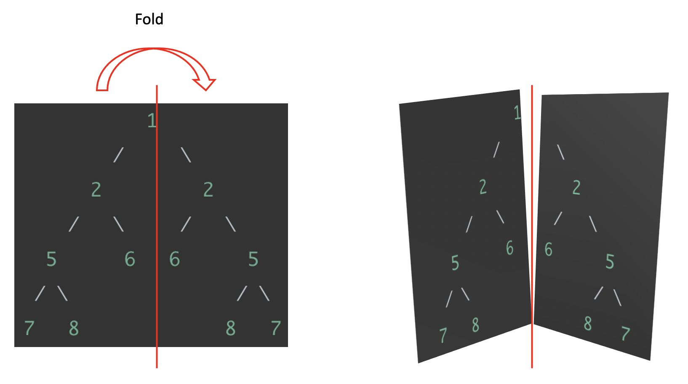
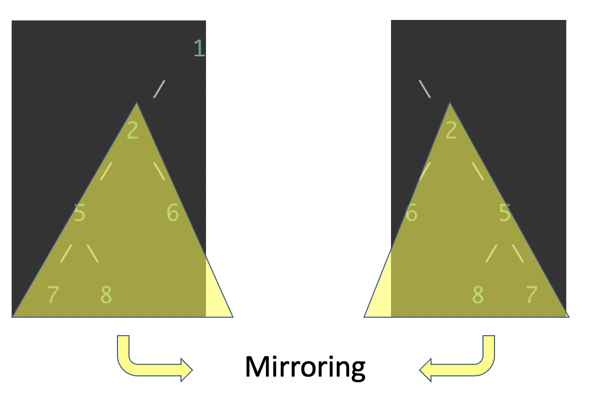

## 2020 Autumn CSS143B Midterm 2 &nbsp; &nbsp; &nbsp; Student Name:

**All choice questions are single choice**

**By "array" or "Java array", it means the primitive Java array like int[], not collection like ArrayList**

**1. (2pt) Which of the following is TRUE comparing linked lists with Java arrays?**

- (A) Accessing a random node in a linked list requires, in the worst-case, a full traversal of the list.
- (B) A stack can be implemented using a linked list, but not uisng an array.
- (C) Both linked lists and arrays are random-access data structures.
- (D) Linked list and array can both change capacity without resorting to memory copy.

**2. (2pt) Without the stopping condition, a recursion function will**

- (A) Crash immediately with NullPointerException
- (B) Continue executing till the stack memory is exhausted
- (C) Continue executing till the heap memory is exhausted
- (D) Continue executing without crash

**3.（2pt) When implementing a stack using a linked list vs array, which statement is WRONG?**

Hint: think carefully about how stack is implemented with both array and linked list respectively, in specific, which end of the data structure should be used for stack "top".

- (A) For the push and pop functions, using array is much faster because linked list always requires traversal to access nodes
- (B) Linkedlist is better in terms of flexible stack capacity without need for memory copy
- (C) Array and linked list can have comparably fast pop and push implementation if the front of the linked list is used as the "top"
- (D) Stack using linked list has a slightly higher storage overhead comparing to array due to the additional node references storage

**4. (2pt) Which of the following is WRONG for a single linked list?**

- (A) It always has a dummy node
- (B) It can be used to implement both Stack and Queue
- (C) It can be visited both recursively and iteratively
- (D) Insertion and deletion of node do not require memory copy of nodes

**5. (2pt) Which of the following is WRONG for binary tree?**

- (A) There's always one root node in a tree
- (B) Each node can only have one parent node
- (C) Each node always has two child nodes, except the leaf node which has none.
- (D) It can be traversed in more than one ways. More than 3 ways actually

**6. (15pt) The local election office uses a software to determine whether a voter has already voted. It keeps a list of voters who have voted in their system for look up. The staff is complaining about the software being slow, and you are tapped to fix this issue. First day on the job, you realized that the software is using an array to store the names of voters in alphabetical order such that binary search can be used for search. If the array is full, a larger array will be allocated and all voter names are copied over. After some debugging, you found that the slowdown happens during insertion especially when the size of voter array is large.**

**6.1  (5pt) Your manager came by and ask you what is the root cause of the slowdown during insertion. Explain your findings:** 

```


```

**6.2  (5pt) Your co-worker Jerry suggested using a linked list as the fix because it allows much faster data insertion regardless how big the data set is. You do not agree to this solution. Explain your reasoning:**

```


```

**6.3  (5pt) Jerry accepted your argument, and then suggested using a binary search tree (BST). His reasons is it's very fast in searching and insertion. However, you have another solution which is hash table. How would you convenience your manager to use your idea to counter Jerry's BST idea?**

```


```

**7.(2pt) Which of the following is WRONG about recursion?**

- (A) Recurision is always more efficent in performance than iterative method for solving the same problem
- (B) IRecurision requires a stopping condition till the problem is small enough to be solved without recursion
- (C) Backtracking is a recursion algorithm where each possible path is tried for solution
- (D) Recursive algorithms can be implemented iteratively using a stack ADT to avoid stack memory exhaustion.

**8.1 (4pt) Write code to implement the fibonacci sequence with recursion. The math definition of fibonacci sequence is:**

```
fib(x) = fib(x-1) + fib(x-2)
```

The code should return the n-th fibnacci sequence using recursion:

```java
Integer fib(Integer n) {

}
```

For example, if n=5, fib(5) will return 5. If n=10, fib(10) will return 55. It's okay to print each number in a new line. Format doesn't matter.

**8.2 (4pt) Write test cases for your fib function in 8.1.**

```


```

**8.3 (5pt) When running the code in 8.1 with larger input n, it's slowing down a lot. For example, fib(45) takes about 30 seconds to finish on some machine. Explain the reason of this slowdown, and explain how it could be improved.**

```


```

**9.1 (10pt) Write code to return all the LEAF nodes in a binary tree.**

The definition of the tree node is:

```java
public class TreeNode<T> {
     public T val;
     public TreeNode left;
     public TreeNode right;
     TreeNode(T x) { val = x; }
 }
```

The leaf nodes are the ones without any child node (both left and right references are null). For example:

``` 
    3
   / \
  9  20
 /    \
1      8
      / \
     7   2
```

The result will be [1, 7, 2], and the order of print should go from **left to the right**.

```java
List<Integer> getLeafNodes(TreeNode<Integer> root) {
  
  
  
  
}
```

Hint: Use recursion.

To help you debugging, here's some code with some tests https://github.com/pdgetrf/midterm-2-whiteboard.git. No need to fork. Just clone this in your IDE and use it to write code. It has some tests. Same for problem 10.

**9.2 (5pt) Write your test cases for code in 9.1 (test cases are just fine, not code required)**

```


```

**10. (10pt) Write code to determine if a binary tree is vertically symmetrical**. 

For example, the following trees are all vertically symmetrical:

```bash
    3		    1                 null
   / \            / \
  9   9        null null
  
       8                   3
     /   \               /   \ 
    5     5            2       2
   /       \         /  \     /  \
  9         9       5    6   6    5
  
                1
             /     \
           2         2
         /   \     /   \
       5      6   6      5
      / \               / \
     7   8             8   7
```

```java
boolean isSymmetrical(TreeNode root) {
      
      
      
   
}
```

"Veritically symmetrical" means if you "fold" the binary tree from the middle veritically, the left and right side would match perfectly, illustrated here:



And the left and right sub-trees are mirrors of each other as shown in the two triangles:



**Hints:**

1. Finish the rest of the exams before this. Not all problems are pointed equal.
2. Use recursion.
3. If a binary tree is "symmetrical", that means below the root node, the left and right subtrees should be mirrors of each other.
4. Use a separate function (also in recursion) to check whether two trees are mirrors of each other.
5. This is a "take-home" exam which means open-book.
6. Do not leave it empty. Write down your thoughts for partial points.

**11. (5pt) Finding similarities between algorithms can help us understand and remember them better.**

**11.1 (3pt) What's the similarity between the recursive and iterative linked list reversal algorithms? We had a special topic lecture. Describe the idea of that similarity. **

```


```

**11.2 (2pt) We have also discussed the similarity between the iterative inorder traverse and printing linked list reversely. Describe that similarity.**

```


```

**12. (15pt) What is the pre-order, in-order and post-order traversal of the following tree?**

```bash
          2
        /   \
       4     5
     /  \     \
    9    1     3
              /
             6
```

pre-order:

```

```

In-order:

```

```

post-order:

```

```

**13.1 (8pt) How would you check if a certain binary tree is also a binary SEARCH tree?**

```bash


```

**13.2 (2pt) Debunk (prove wrong) the following testing logic?**


"You can test a binary tree to be a binary search tree by simply checking whether the in-order traverse of that tree is a sorted array. For example, if the inorder traverse output is [2,5,6,7], this can be determined as a BST because this is a sorted array (each element is larger than the one before it)."


Hint: what would be the case in which the in-order traverse does not work properly but a test using the above logic can still pass?

```


```

**14 (5pt) Given the following code to compute all permutation (as we had in homework).**

```java
public class Permutation {
    public static List<List<Integer>> permute(int[] nums) {
        List<List<Integer>> result = new ArrayList<>();
        helper(nums, 0, result);
        return result;
    }
    private static void helper(int[] nums, int k, List<List<Integer>> results) {
        if (nums.length == 0 || k == nums.length - 1) {
            List<Integer> r = new ArrayList<>();
            for (int n : nums) {
                r.add(n);
            }
            results.add(r);
            return;
        }
        for (int i = k; i < nums.length; i++) {
            swap(nums, k, i);    // 1st time
            helper(nums, k + 1, results);
            swap(nums, k, i);    // 2nd time
        }
    }
    private static void swap(int[] nums, int i, int j) {
        int k = nums[i];
        nums[i] = nums[j];
        nums[j] = k;
    }
}
```

Explain why the swap function is called twice as commented above.

```


```

## Extra Credits

**(5pt) 1. What's the relationship between HashMap and TreeMap in terms of the interface and internal data storage? And which one is faster for searching?**

```


```

**(3pt) 2. Briefly describe how buffer overflow attack works?**

```


```

**(2pt) 3. What was the movie Inception brought up in the lecture for?**

```


```
