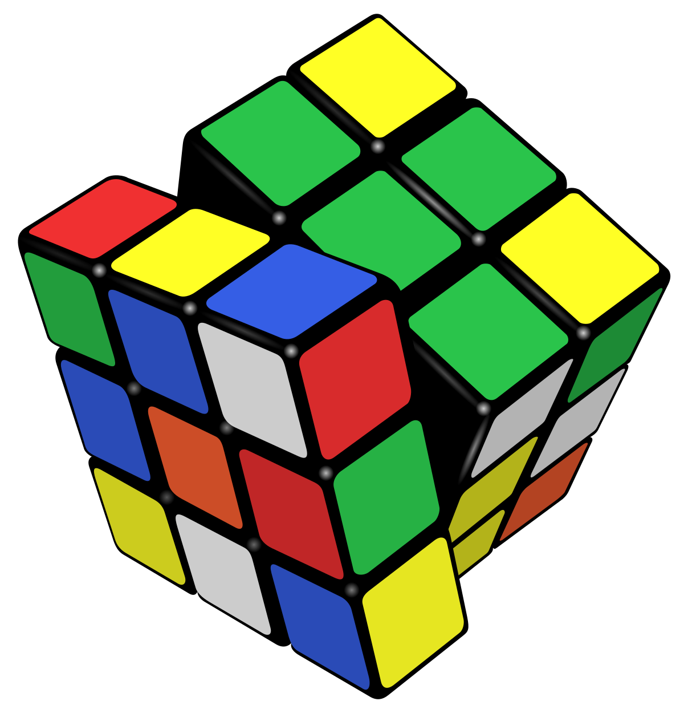

## (40pt) Recursion and backtracking

### 1.1 (10pt) Write a function to perform binary search recursively in an ascendingly sorted integer array. ###

We did the binary search in homework 1. This time let's do it again but put our recursion idea to some use. 

The binary search function takes an integer to find, and returns an **index** of the input value if found. -1 if target is not found.

For example:

- Searching 6 in array [1, 3, 6, 8, 9] should return 2 because number 6 appears at index 2.
- Searching 9 in array [1, 3, 6, 8, 9] should return 4.
- Searching 7 in array [1, 3, 6, 8, 9] should return -1 because 7 is not found in this array.
- Searching 6 in array [1, 3, 6, 6, 9] should return 2 because the first 6 appears at index 2.

Your test can assume input array is correctly sorted. 

Tests are provided to you. Upon finish, all tests should pass. 

### 1.2 (20) Write the code to output all permutations of a set of distinct numbers. ###

*"Permutation"* by definition means:

```
A way, especially one of several possible variations, in which a set or number of things can be ordered or arranged.
```

For example, give 1 number [1], there's only 1 permutation 1.

For 2 numbers 1 and 2, there are two permutations [1,2] and [2,1].

For 3 numbers, there are six permutations

```
[
  [1,2,3],
  [1,3,2],
  [2,1,3],
  [2,3,1],
  [3,1,2],
  [3,2,1]
]
```

The way to think of this is each number will need to appear as the first number of a sequence, for example, [1,2,3] and
 [1,3,2] both starts with 1. [2,1,3] and [2,3,1] both start with 2, and [3,1,2] and [3,2,1] both start with 3. Same rules for the 2nd place. For [1,2,3] and [1,3,2], because the first number are both 1, then only 2 and 3 can appear as the second number. If 2 is the second number, then 3 can only be the 3rd and last number. This is natural recursion problem. The idea is if you pick a number to put in the first location, and you have all the permutations from the rest numbers, you wil have the permutation with all the numbers that start with that number you picked. 

This algorithm will be discussed in details in the Monday lecture. 

Must use recursion to solve this problem. You will also probably need a loop.

### 1.3 (10pt) Revese a stack using recursion ###

Write a function to reverse the values in a stack.

```java
    void reverseStack(Stack<Integer> stack) {
        // homework
    }
```

Requirements:

- Any loop such as "for", "while" is not allowed. Zero point if any loop is used. OK to add helper function.
- Cannot use collection storage such as array, stack, queue, map. If you want to use something but not sure, please ask.
- Must use recursion.
