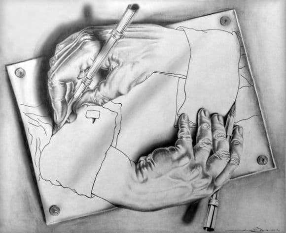

## (10pt) Print A Single Linked List In Reverse Order

Going backward is fun sometimes.

Let's write a function to print a single linked list backward to the screen.

"if one can only go one-way from head to tail in a single linked list, how do we travel through it backward? Oh wait! Didn't we do this in the last homework already?", you migth also ask.

And the answer is yes. This is the same problem we solve in the last homework. One critical difference here though. Last time we used a Stack to solve this. This time it'll be recursion instead. Stack and recursion are two great ways to visit a linear sequence backward. And if pushed, I'd argue they are in fact the same method. 

No stack or any other collection data structure is allowed, and no loop of any kind is allowed either. Violation either of these will result in zero the points.