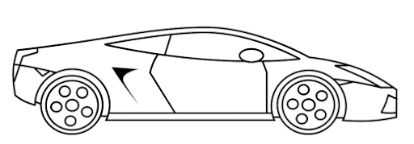

## Sense Of Speed

### Dates

    - Assigned: 12/05/2020
    - Due: 11/16/2020 Wednesday 11:59pm

## Goals ##

- Dictionary
- Algorithm Complexity

### Problems To Solve

There are ***Three*** problems to answer:

- [Problem 0](problem_0.md) (10pt)
- [Problem 1](problem_1.md) (40pt)
- [Problem 2](problem_2.md) (30pt)

### Code ###

[Starter code](https://github.com/pdgetrf/CSS143B-2020Fall-homework6).

All tests are provided to you. Upon finish, all tests should pass. DO NOT REMOVE OR CHANGE GIVEN TESTS.

Homework submission without using this provided code will receive 0 point.

### Work Instruction
- Create your own account at https://github.com/
- Fork (means "duplicate") the instructor repo https://github.com/pdgetrf/CSS143B-2020Fall-homework6 to your own repo.
- In the Action tab of the repo, click the green button to enable Action.
- Open your own repo in Intellij using "Get From Version Control".
- Create a new branch called "work" (you can pick your own name here), and switch to this new branch (automatically in Intellij).
- Finish the homework in the "work" branch. Make commits and push frequently so your work is kept online safely. The first time when you push online, Intellij will ask you to log in with token or OATH. Token is the easiest way. [Here's an instruction](https://docs.github.com/en/free-pro-team@latest/github/authenticating-to-github/creating-a-personal-access-token). This will also be demo'd in lecture.
- Once the homework is ready to for submission, head to your own repo on Github and create a pull request from your "work" branch towards ***your master branch***. NOTE: DO NOT CREATE THE PULL REQUEST TOWARDS THE INSTRUCTOR'S REPO.
- Submit the url of your pull request in Canva.
- DO NOT make new code commits after submission deadline. Violation will be treated as late homework.
- Once grading is done, teacher will mark the PR as "approved" and grade will be published to Canvas.

A demo of this process can be found [in the lecture recording of Monday lecture of week 2](https://youtu.be/X_2xcKMUMBg).

### Notes ###

- Start early. Be active. Ask questions.
- Partial credits will be given. If you cannot finish some part, add comments describing your thinking.
- OK to search web for help. Give credits in your code if you use any. 
- Homework is to be done by yourself. Okay to discuss with others. 
- Late submission without both explanation AND permission will receive **ZERO** point.  
- Read grader and teacher's code review comments. Be open to accept them for improvement but be prepared to defend your choice. 

### Code of Conduct

Plagarism will not be tolerated and will receive **ZERO** point, this includes (but not limited to)

- Copy others' code line by line.
- Copy online resources line by line, with or without giving credits.

Offense will be reported to the department.

